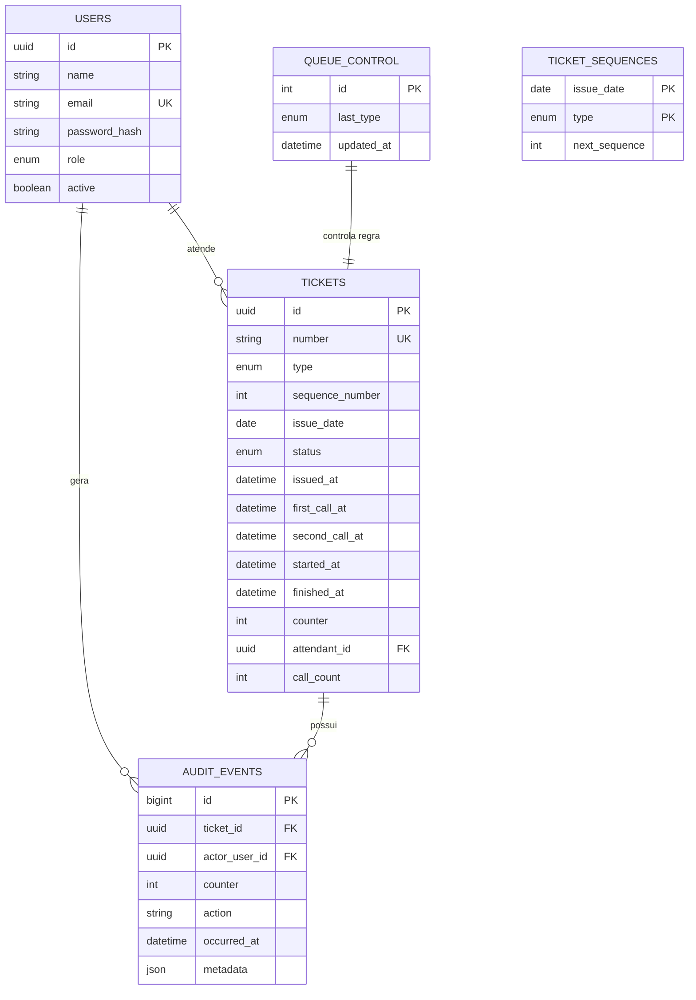

# Modelo Entidade-Relacionamento

```mermaid
erDiagram
    USERS ||--o{ TICKETS : "atende"
    USERS ||--o{ AUDIT_EVENTS : "gera"
    TICKETS ||--o{ AUDIT_EVENTS : "possui"
    QUEUE_CONTROL ||--|| TICKETS : "controla regra"
    TICKET_SEQUENCES {
      date issue_date PK
      enum type PK
      int next_sequence
    }
    USERS {
      uuid id PK
      string name
      string email UK
      string password_hash
      enum role
      boolean active
    }
    TICKETS {
      uuid id PK
      string number UK
      enum type
      int sequence_number
      date issue_date
      enum status
      datetime issued_at
      datetime first_call_at
      datetime second_call_at
      datetime started_at
      datetime finished_at
      int counter
      uuid attendant_id FK
      int call_count
    }
    AUDIT_EVENTS {
      bigint id PK
      uuid ticket_id FK
      uuid actor_user_id FK
      int counter
      string action
      datetime occurred_at
      json metadata
    }
    QUEUE_CONTROL {
      int id PK
      enum last_type
      datetime updated_at
    }
```
