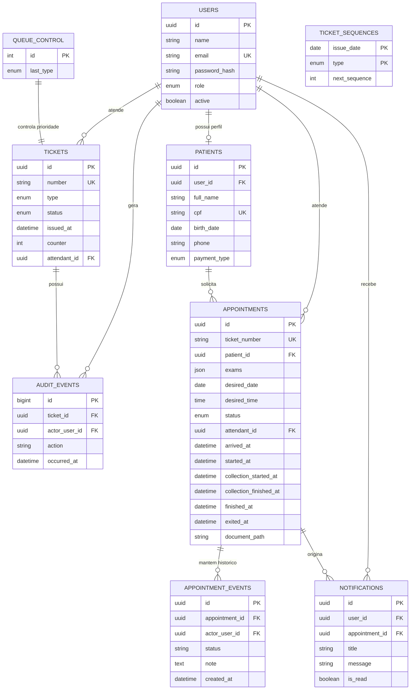

# Modelo Entidade-Relacionamento

```mermaid
erDiagram
    USERS ||--o| PATIENTS : "possui perfil"
    USERS ||--o{ TICKETS : "atende"
    USERS ||--o{ AUDIT_EVENTS : "gera"
    USERS ||--o{ APPOINTMENTS : "atende"
    USERS ||--o{ NOTIFICATIONS : "recebe"
    PATIENTS ||--o{ APPOINTMENTS : "solicita"
    TICKETS ||--o{ AUDIT_EVENTS : "possui"
    APPOINTMENTS ||--o{ APPOINTMENT_EVENTS : "mantem historico"
    APPOINTMENTS ||--o{ NOTIFICATIONS : "origina"
    QUEUE_CONTROL ||--|| TICKETS : "controla prioridade"

    USERS {
      uuid id PK
      string name
      string email UK
      string password_hash
      enum role
      boolean active
    }
    PATIENTS {
      uuid id PK
      uuid user_id FK
      string full_name
      string cpf UK
      date birth_date
      string phone
      enum payment_type
    }
    APPOINTMENTS {
      uuid id PK
      string ticket_number UK
      uuid patient_id FK
      json exams
      date desired_date
      time desired_time
      enum status
      uuid attendant_id FK
      datetime arrived_at
      datetime started_at
      datetime collection_started_at
      datetime collection_finished_at
      datetime finished_at
      datetime exited_at
      string document_path
    }
    APPOINTMENT_EVENTS {
      uuid id PK
      uuid appointment_id FK
      uuid actor_user_id FK
      string status
      text note
      datetime created_at
    }
    NOTIFICATIONS {
      uuid id PK
      uuid user_id FK
      uuid appointment_id FK
      string title
      string message
      boolean is_read
    }
    TICKETS {
      uuid id PK
      string number UK
      enum type
      enum status
      datetime issued_at
      int counter
      uuid attendant_id FK
    }
    AUDIT_EVENTS {
      bigint id PK
      uuid ticket_id FK
      uuid actor_user_id FK
      string action
      datetime occurred_at
    }
    QUEUE_CONTROL {
      int id PK
      enum last_type
    }
    TICKET_SEQUENCES {
      date issue_date PK
      enum type PK
      int next_sequence
    }
```

O atendimento clínico é mantido em `APPOINTMENTS` e `APPOINTMENT_EVENTS`; as senhas anônimas legadas permanecem em `TICKETS` e `AUDIT_EVENTS`.
