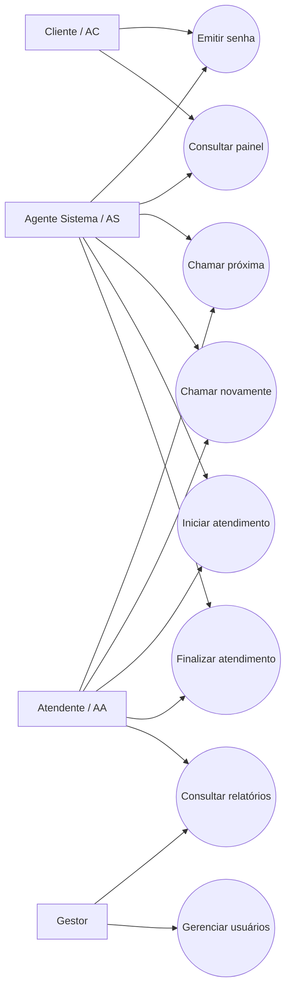

# UML — Casos de uso

```mermaid
flowchart LR
  AC[Cliente / AC] --> UC1((Emitir senha))
  AC --> UC2((Consultar painel))
  AA[Atendente / AA] --> UC3((Chamar próxima))
  AA --> UC4((Chamar novamente))
  AA --> UC5((Iniciar atendimento))
  AA --> UC6((Finalizar atendimento))
  AA --> UC7((Consultar relatórios))
  G[Gestor] --> UC7
  G --> UC8((Gerenciar usuários))
  AS[Agente Sistema / AS] --> UC1
  AS --> UC2
  AS --> UC3
  AS --> UC4
  AS --> UC5
  AS --> UC6
```
