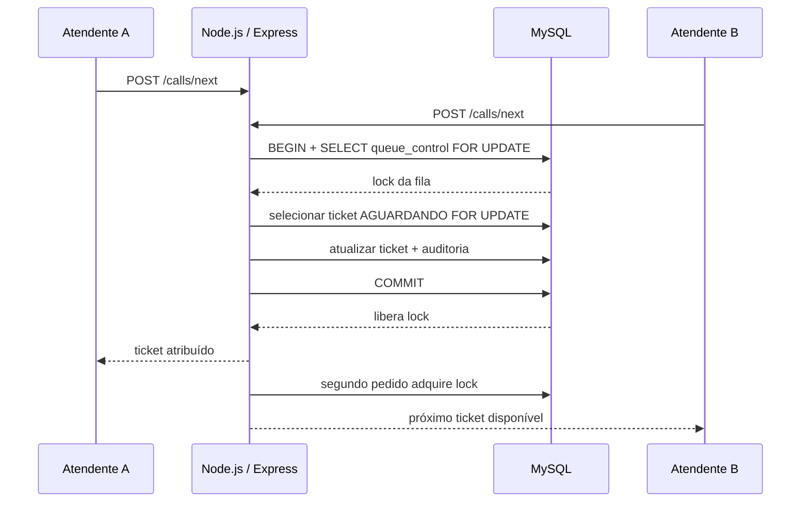

# UML — Sequência de chamada concorrente

```mermaid
sequenceDiagram
    participant AA1 as Atendente A
    participant API as Node.js / Express
    participant DB as MySQL
    participant AA2 as Atendente B

    AA1->>API: POST /calls/next
    AA2->>API: POST /calls/next
    API->>DB: BEGIN + SELECT queue_control FOR UPDATE
    DB-->>API: lock da fila
    API->>DB: selecionar ticket AGUARDANDO FOR UPDATE
    API->>DB: atualizar ticket + auditoria
    API->>DB: COMMIT
    DB-->>API: libera lock
    API-->>AA1: ticket atribuído
    API->>DB: segundo pedido adquire lock
    API-->>AA2: próximo ticket disponível
```

O objetivo é impedir que duas requisições obtenham a mesma senha.
